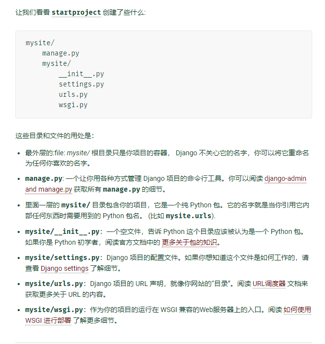

DJango
===

* 开发环境 Ubuntu 18.04
* django版本 2.2.6

* 虚拟环境名 django-learn

进入虚拟环境： workon + 虚拟环境名

退出虚拟环境： deactivate

__创建Django项目:__ 

django-admin startproject 项目名

### django推荐的项目规范

按照功能或者模块进行分层，分成一个个app。所有和某个模块相关的视图都写在对应的app的views.py中。

__创建app的命令：__ python manage.py startapp 应用名

