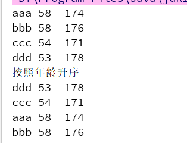

### Lambda的标准格式

___

```java
(参数类型 参数名称) -> {
	//方法体 
}
```

##### 格式说明：

* (参数类型 参数名称)）：参数列表
* `->` : 箭头，分隔参数列表和方法体
* {方法体} :  代码


##### 无参数无返回值的Lambda表达式练习

* 当函数的参数是一个接口对象时，可以考虑使用Lambda表达式

```java
/*
* 创建一个接口
*/
public interface Swimmable {
    public abstract void swimming();
}

```

```java
/* 
* 在主函数中使用匿名内部类的方式和Lambda表达式的方式去实现接口中的方法
*/
public class labmda01 {
    public static void main(String args[]){
        // 匿名内部类方式
        goSwimming(new Swimmable() {
            @Override
            public void swimming() {
                System.out.println("我是匿名内部类中的方法");
            }
        });
		// 无参数无返回值的Lambda
        goSwimming(()->{
            System.out.println("我是Lambda表达式中的方法");
        });
    }

    
    public static void goSwimming(Swimmable s){
        s.swimming();
    }
}
```


##### 有参数有返回值的Lambda表达式练习

```java
public class lambda02 {
    public static void main(String args[]){

        ArrayList<Person> persons = new ArrayList<>();
        persons.add(new Person("aaa", 58, 174));
        persons.add(new Person("bbb", 58, 176));
        persons.add(new Person("ccc", 54, 171));
        persons.add(new Person("ddd", 53, 178));

        // 使用匿名内部类进行排序
        Collections.sort(persons, new Comparator<Person>() {
            @Override
            public int compare(Person o1, Person o2) {
                // 按照年龄降序排序
                return o2.getAge() - o1.getAge();
            }
        });

        for(Person person:persons)
            System.out.println(person);

        // 使用Lambda表达式排序
        Collections.sort(persons,(Person o1, Person o2)->{
            return o1.getAge()-o2.getAge();
        });
        System.out.println("按照年龄升序");
        for(Person person:persons)
            System.out.println(person);
    }
}
```



### 小结

* 当函数的参数是接口时，可以考虑使用Lambda表达式来替换匿名内部类，但不是所有的匿名内部类都能够被Lambda表达式所替换；Lambda表达式相当是接口的抽象方法的重写