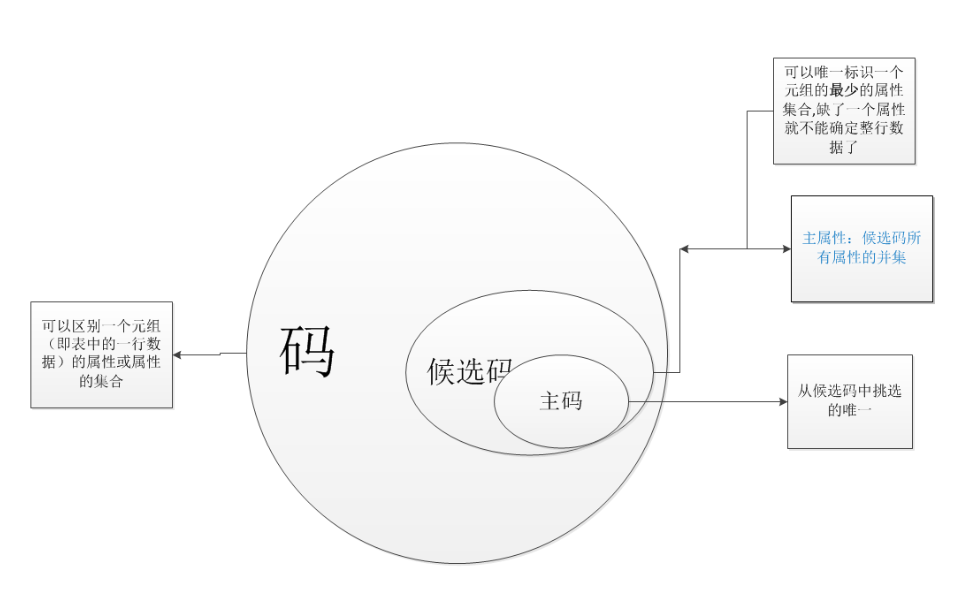
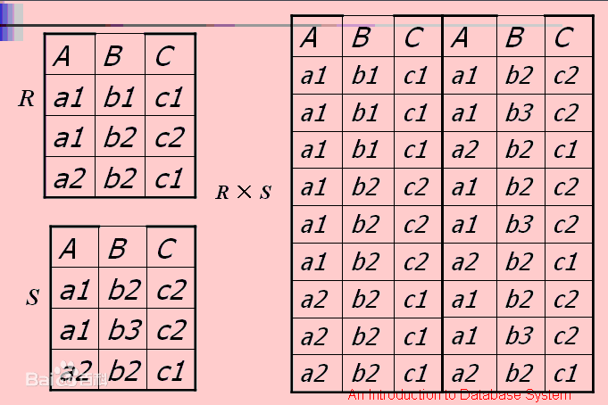

[约束](#1)

[数据库设计](#2)

[多表查询](#3)

[事务](#4)


<h2 id="1">约束</h3>

#### 非空约束 ： not null

删除非空约束

```mysql
alter table 表名 modify 列名 字段类型(字段大小);
```

创建完表后，添加非空约束

```mysql
alter table 表名 modify 列名 字段类型(字段大小) not null;
```


#### 唯一约束 ： unique, 值不能重复, 但可以有多个null

删除唯一约束

```mysql
alter table 表名 drop index 列名;
```

**创建表后，添加唯一约束**

```mysql
alter table 表名 modify 列名 字段类型(字段大小) unique;
```


#### 主键约束 ： primary key, 非空且唯一

删除主键

```mysql
alter table 表名 drop primary key;
```

创建表后，添加主键

```mysql
alter table 表名 modify 列名 字段类型 primary key;
```

自动增长 :  auto_increment

```mysql
create table 表名(
	列名 字段类型 primary key auto_increment
);
```

删除自动增长

```mysql
alter table 表名 modify 列名 字段类型;
```

创建表后，设置自动增长

```mysql
alter table 表名 modify 列名 字段类型 auto_increment;
```


#### 外键约束 ： foreign key

建表时添加外键

```mysql
create table 表名(
	...,
    外键列,
    constraint 外键名称 foreign key (外键列) references 主表名称(主表列名称)
);
```

删除外键

```mysql
alter table 表名 drop foreign key 外键名称;
```

建表后添加外键

```mysql
alter table 表名 add constraint 外键名称 foreign key (外键列) references 主表名称(主表列名称);
```

添加外键时设置级联更新, on update cascade, 在修改主表中主键的值时，外键的值也会随之更改

```mysql
alter table 表名 add constraint 外键名称 foreign key (外键列) references 主表名称(主表列名称) on update cascade;
```

添加外键时设置级联删除，on delete cascade， 主表中某一主键的行被删除，那么以它作为外键的数据也被删除

```mysql
alter table 表名 add constraint 外键名称 foreign key (外键列) references 主表名称(主表列名称) on delete cascade;
```


<h2 id="2">数据库设计</h3>

#### 多表间的关系

一对一

- 在两张表中的任意一张表添加外键指向对方的主键，并且让外键唯一，unique

- 合为一张表

一对多

​	在“多”的一方建立外键，指向“一”的主键

多对多

​	建立一张中间表，中间表至少包含两个字段，这两个字段作为中间表的外键，分别指向两张表的主键


#### 数据库范式

第一范式（1NF）

```
每一列都是不可分割的原子数据项
```


第二范式（2NF）

```
在1NF的基础上，消除非主属性对主码的部分函数依赖
```

1.  函数依赖：A--->B，如果通过A属性（属性组）的值，可以确定唯一的B属性的值，则称B依赖于A

​		例如： 学号--->姓名。  (学号，课程名称)--->分数

 2. 完全函数依赖： A--->B,如果A是一个属性组，B属性值的确定需要依赖于A属性组中所有的属性值。

    例如： （学号，课程名称）---> 分数

3. 部分函数依赖： A--->B，如果A是一个属性组，则B属性值的确定只需要依赖A属性组中的某一些值即可。

   例如：（学号，课程名称）---> 姓名

4. 传递函数依赖：A--->B, B--->C, 如果通过A属性（属性组）的值，可以确定唯一的B属性的值，再通过B属性（属性组）的值可以确定唯一C属性的值，则 C 传递依赖于A。

   例如： 学号--->系名，系名--->系主任

   

   **码=****超键**：能够**唯一标识**一条记录的属性或属性集。

   **候选码**：能够**唯一标识**一条记录的**最小属性集**

   **主码**：**某个**能够**唯一标识**一条记录的**最小属性集（是从候选码里人为挑选的一条）**

   **主属性**： 包含在任一候选码中的属性称主属性。简单来说，主属性是候选码所有属性的并集

   **非主属性**： 不包含在候选码中的属性称为非主属性。 非主属性是相对于主属性来定义的。




第三范式（3NF）

```
在2NF的基础上，消除传递依赖
```


<h2 id="3">多表查询</h3>

笛卡尔积： 两个集合的所有组成情况




#### 内连接查询

隐式内连接

```mysql
使用where条件消除无用数据
```

显式内连接

```mysql
语法： select 字段列表 from 表1 [inner] join 表2 on 条件;  关键字innner可省略

```

#### 外连接查询

​	以某张表为主表，取出里面的所有记录然后每条与另外一张表进行连接；不管能不能匹配上，最终都会保留；能匹配，正确保留，不能匹配，其它字段为null.

左外连接

```mysql
select 字段列表 from 表1 left [outer] join 表2 on 条件; 关键字outer可省略
-- 查询的是左表所有数据以及两表的交集部分
```

右外连接

```mysql
select 字段列表 from 表1 right [outer] join 表2 on 条件; 关键字outer可省略
-- 查询的是右表所有数据以及两表的交集部分
```

#### 子查询

查询中嵌套查询

```mysql
select * from 表名 where 字段名 = (子查询语句);
```

*子查询的结果是单行单列的：*

​	子查询可以作为条件，使用运算符去判断(=,>,<,<=,>=,!=)

*子查询的结果是多行单列的：*

```mysql
select * from 表名 where 字段名 in (子查询语句);
使用运算符IN来判断
```

*子查询的结果是多行多列的：*

​	子查询可以作为一张临时表


<h2 id="4">事务</h3>

#### 四个特征

```mysql
原子性： 一个事务是一个不可分割的工作单位，事务中包括的操作要么都做，要么都不做。

一致性：事务必须是使数据库从一个一致性状态变到另一个一致性状态。一致性与原子性是密切相关的。

隔离性：一个事务的执行不能被其他事务干扰。即一个事务内部的操作及使用的数据对并发的其他事务是隔离的，并发执行的各个事务之间不能互相干扰。

持久性：持久性也称永久性，指一个事务一旦提交，它对数据库中数据的改变就应该是永久性的。接下来的其他操作或故障不应该对其有任何影响。
```

#### 事务隔离级别

* **概念**： 因为事务具有隔离性，所以当多个事务操作同一批数据，就会引发一些问题，设置不同的隔离级别可以解决这些问题。
* 存在问题：
  * 脏读 ： 一个事务读取到另一个事务中没有提交的数据
  * 不可重复读（虚读） ： 在同一个事务中，两次读取到的数据不一样
  * 幻读 ： 一个事务 增/删/改 数据表中所有的记录，另一个事务添加了一条数据，则第一个事务查询不到自己的修改

* 隔离级别：
  * read uncommitted : 
    * 产生的问题： 脏读、不可重复读、幻读
  * read committed: 
    * 产生的问题：不可重复读，幻读
  * repeatable read:
    * 产生的问题：幻读
  * serializable: 串行话
    * 可以解决所有问题
* 数据库查询隔离级别：

```mysql
select @@tx_isolation;
```

* 数据库设置隔离级别

```mysql
set global transaction isolation level 级别字符串;
```

