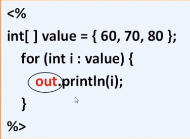
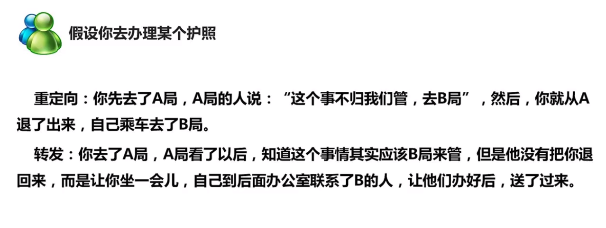

JSP内置对象
===

## 内置对象简介

​	__jsp内置对象__是Web容器创建的一组对象，不使用new关键词就可以使用的内置对象。比如out内置对象：

### 常用的jsp内置对象

> __out__
>
> >__常用方法:__
> >
> >void println()  向客户端打印字符串
> >
> >void clear()  清除缓冲区的内容，如果在flush之后调用会抛出异常
> >
> >void clearBuffer()  清除缓冲区的内容，如果在flush之后调用不会抛出异常
> >
> >void flush()  将缓冲区内容输出到客户端
> >
> >int getBufferSize()  返回缓冲区字节数的大小，不设置缓冲区则为0
> >
> >int getRemaining()  返回缓冲区还剩余多少可用
> >
> >boolean isAutoFlush()  返回缓冲区满时， 是自动请空还是抛出异常
> >
> >void close()  关闭输出流
>
> __request__
>
> > ​    客户端的请求信息被封装在request对象中，通过它才能了解到客户的需求，然后做出响应。它是HttpServletRequest类的实例。request对象具有请求域，即完成客户端的请求之前，该对象一直有效。
> >
> > __常用方法:__
> >
> > String getParameter(String name)  返回name指定参数的参数值
> >
> > String[] getParameterValues(String name)  返回包含参数name的所有值的数组
> >
> > void setAttribute(String, Object)  存储此请求中的属性
> >
> > object getAttribute(String name)  返回指定属性的属性值
> >
> > String getContentType()  得到请求体的MIME类型
> >
> > String getProtocol()  返回请求用的协议类型和版本号
> >
> > String getServerName()  返回接受请求的服务器主机名
> >
> > request.setCharacterEncoding("utf-8") 可以解决表单传递参数时的中文乱码问题
>
> __response__
>
> > ​    response对象包含了响应客户请求的有关信息，但在jsp中很少直接用到它。它是HttpServletResponse类的实例。response对象具有页面作用域，即访问一个页面时，该页面内的response对象只能对这次访问有效，其它页面的response对象对当前页面无效。
> >
> > __常用方法：__
> >
> > String getCharacterEncoding()  返回响应用的是哪种字符编码
> >
> > void setContentType(String type)  设置响应的MIME类型
> >
> > PrintWriter getWriter()  返回可以向客户端输出字符的一个对象，该对象的打印顺序早于out内置对象
> >
> > sendRedirect(java.lang.String.location)  重新定向客户端的请求
> >
> > __请求重定向__不同于__请求转发__，
> >
> > __请求重定向__是客户端行为，response.sendRedirect(),从本质上来讲等同于两次请求，前一次的请求对象不会保存，地址栏的url地址会改变。
> >
> > __请求转发__是服务器行为，request.getReqeustDispathcer().forward(res,resp);是一次请求，转发后请求对象会保存，地址栏的URL地址不会改变
> >
> > 
>
> __session__
>
> > 
>
> __application__
>
> > 

_其它内置对象_

>Page
>
>pageContext
>
>exception
>
>config

## 四种作用域范围

## out

## request/response

## session

## application

## 其它内置对象

