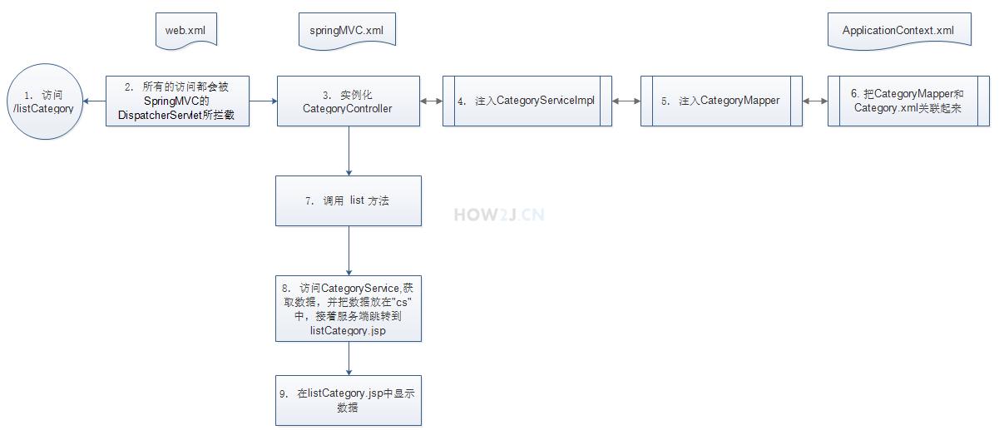

SSM整合步骤
===

1. [新建项目，导入包](#1)
2. [pojo](#2)
3. [Mapper接口](#3)
4. [Mapper的xml配置文件](#4)
5. [业务接口](#5)
6. [业务实现类](#6)
7. [控制类](#7)
8. [web.xml（:star:重要:star:）](#8)
9. [applicationContext.xml（Spring核心配置）](#9)
10. [springMVC.xml（SpringMVC核心配置）](#10)
11. [前端jsp文件](#11)
12. [部署tomcat](#12)
13. [思路图](#13)


---

<h3 id="1">1. 建项目，导入jar包</h3>

使用dynamic web project的方式新建项目，然后导入jar包到 WEB-INF/lib 下

__数据库信息: __

```sql
create database how2java;

use how2java;
  
CREATE TABLE category_ (
  id int(11) NOT NULL AUTO_INCREMENT,
  name varchar(30) ,
  PRIMARY KEY (id)
) DEFAULT CHARSET=UTF8;

insert into category_ values(null,"category1");
insert into category_ values(null,"category2");
insert into category_ values(null,"category3");
insert into category_ values(null,"category4");
insert into category_ values(null,"category5");
 
select * from category_

```


<h3 id="2">2. Category.java</h3>

```java
package com.how2java.pojo;
 
public class Category {
    private int id;
    private String name;
    public int getId() {
        return id;
    }
    public void setId(int id) {
        this.id = id;
    }
    public String getName() {
        return name;
    }
    public void setName(String name) {
        this.name = name;
    }
    @Override
    public String toString() {
        return "Category [id=" + id + ", name=" + name + "]";
    }
     
}
```


<h3 id="3">3.CategoryMapper.java</h3>

```java
package com.how2java.mapper;
  
import java.util.List;
 
import com.how2java.pojo.Category;
  
public interface CategoryMapper {
  
    public int add(Category category); 
        
    public void delete(int id); 
        
    public Category get(int id); 
      
    public int update(Category category);  
        
    public List<Category> list();
     
    public int count(); 
     
}
```


<h3 id="4">4. CategoryMapper.xml</h3>

CategoryMapper.xml需要和CategoryMapper.xml放在同一个包下

mapper标签的`namespace`要写CategoryMapper的`完整类名`

```xml
<?xml version="1.0" encoding="UTF-8"?>
<!DOCTYPE mapper
    PUBLIC "-//mybatis.org//DTD Mapper 3.0//EN"
    "http://mybatis.org/dtd/mybatis-3-mapper.dtd">
 
    <mapper namespace="com.how2java.mapper.CategoryMapper">
        <insert id="add" parameterType="Category" >
            insert into category_ ( name ) values (#{name})   
        </insert>
         
        <delete id="delete" parameterType="Category" >
            delete from category_ where id= #{id}  
        </delete>
         
        <select id="get" parameterType="_int" resultType="Category">
            select * from   category_  where id= #{id}   
        </select>
 
        <update id="update" parameterType="Category" >
            update category_ set name=#{name} where id=#{id}   
        </update>
        <select id="list" resultType="Category">
            select * from   category_     
        </select>    
    </mapper>
```


<h3 id=5>5. CategoryService.java</h3>

```java
package com.how2java.service;
 
import java.util.List;
 
import com.how2java.pojo.Category;
 
public interface CategoryService {
 
    List<Category> list();
 
}
```


<h3 id="6">6. CategoryServiceImpl.java</h3>

```java
package com.how2java.service.impl;
 
import java.util.List;
 
import org.springframework.beans.factory.annotation.Autowired;
import org.springframework.stereotype.Service;
 
import com.how2java.mapper.CategoryMapper;
import com.how2java.pojo.Category;
import com.how2java.service.CategoryService;

// 添加注解，相当于在Spring中注册了一个bean
@Service
public class CategoryServiceImpl  implements CategoryService{
    // 注入Mapper接口对象
    @Autowired
    CategoryMapper categoryMapper;
     
    public List<Category> list(){
        return categoryMapper.list();
    }
 
}
```


<h3 id="7">7. CategoryController.java</h3>

```java
package com.how2java.controller;
 
import java.util.List;
 
import org.springframework.beans.factory.annotation.Autowired;
import org.springframework.stereotype.Controller;
import org.springframework.web.bind.annotation.RequestMapping;
import org.springframework.web.servlet.ModelAndView;
 
import com.how2java.pojo.Category;
import com.how2java.service.CategoryService;
 
// 告诉spring mvc这是一个控制器类
@Controller
@RequestMapping("")
public class CategoryController {
    // 注入 业务接口对象
    @Autowired
    CategoryService categoryService;
 
    // 该方法映射到路径/listCategory
    @RequestMapping("listCategory")
    public ModelAndView listCategory(){
        ModelAndView mav = new ModelAndView();
        List<Category> cs= categoryService.list();
         
        // 放入转发参数
        mav.addObject("cs", cs);
        // 由listCategory.jsp处理
        mav.setViewName("listCategory");
        return mav;
    }
 
}
```


<h3 id="8">8. web.xml（重要）</h3>

在web.xml中要配置的有：

- 负责启动spring的`listener`
- 用于配置applicationContext.xml 路径的的 `context-param`
- 前端控制器DispatcherServlet, 在DispatcherServlet 的配置中加入spring mvc 的配置文件

```xml
<?xml version="1.0" encoding="UTF-8"?>
<web-app xmlns:xsi="http://www.w3.org/2001/XMLSchema-instance"
         xmlns="http://java.sun.com/xml/ns/javaee"
         xmlns:web="http://java.sun.com/xml/ns/javaee"
         xsi:schemaLocation="http://java.sun.com/xml/ns/javaee http://java.sun.com/xml/ns/javaee/web-app_2_5.xsd" version="2.5">
     
    <!-- spring的配置文件 -->
    <!-- 配置spring核心文件的路径, 默认路径是/WEB-INF/application.xml -->
    <context-param>
        <param-name>contextConfigLocation</param-name>
        <param-value>classpath:applicationContext.xml</param-value>
    </context-param>
    <!-- 配置一个Listener, 用于spring的加载 -->
    <!-- 通过ContextLoaderListener在web app启动的时候，获取contextConfigLocation配置文件的文件名applicationContext.xml，并进行Spring相关初始化工作
-->
    <listener>
        <listener-class>org.springframework.web.context.ContextLoaderListener</listener-class>
    </listener>
     
    <!-- spring mvc核心：分发servlet -->
    <servlet>
        <servlet-name>mvc-dispatcher</servlet-name>
        <servlet-class>org.springframework.web.servlet.DispatcherServlet</servlet-class>
        <!-- 增加一个参数，spring mvc的配置文件 -->
        <init-param>
            <param-name>contextConfigLocation</param-name>
            <param-value>classpath:springMVC.xml</param-value>
        </init-param>
        <load-on-startup>1</load-on-startup>
    </servlet>
    <servlet-mapping>
        <servlet-name>mvc-dispatcher</servlet-name>
        <!-- 所有的访问都要由DispatcherServler进行解析 -->
        <url-pattern>/</url-pattern>
    </servlet-mapping>
     
</web-app>
```

<h3><a href="./web.xml的加载过程">web.xml的加载过程</a></h3>


<h3 id="8">8. applicationContext.xml</h3>

- 配置数据源（DataSource）
- 配置SqlSessionFactoryBean
- 配置MapperScannerConfigurer - 自动扫描mapper包

```xml
<?xml version="1.0" encoding="UTF-8"?>
<beans xmlns="http://www.springframework.org/schema/beans"
    xmlns:xsi="http://www.w3.org/2001/XMLSchema-instance" xmlns:aop="http://www.springframework.org/schema/aop"
    xmlns:tx="http://www.springframework.org/schema/tx" xmlns:jdbc="http://www.springframework.org/schema/jdbc"
    xmlns:context="http://www.springframework.org/schema/context"
    xmlns:mvc="http://www.springframework.org/schema/mvc"
    xsi:schemaLocation="
     http://www.springframework.org/schema/context http://www.springframework.org/schema/context/spring-context-3.0.xsd
     http://www.springframework.org/schema/beans http://www.springframework.org/schema/beans/spring-beans-3.0.xsd
     http://www.springframework.org/schema/jdbc http://www.springframework.org/schema/jdbc/spring-jdbc-3.0.xsd
     http://www.springframework.org/schema/tx http://www.springframework.org/schema/tx/spring-tx-3.0.xsd
     http://www.springframework.org/schema/aop http://www.springframework.org/schema/aop/spring-aop-3.0.xsd
     http://www.springframework.org/schema/mvc http://www.springframework.org/schema/mvc/spring-mvc.xsd">
     
    
    <!-- 用于激活注解,让我们可以使用@Autowired、@Resource、@Required等注解 -->
   <context:annotation-config />
    
    <context:component-scan base-package="com.how2java.service" />
 
    <!--数据源配置:采用Spring默认的DriverManagerDataSource -->
    <!-- 配置连接数据库的驱动，URL，账号和密码 -->
    <bean id="dataSource" class="org.springframework.jdbc.datasource.DriverManagerDataSource"> 
      <property name="driverClassName"> 
          <value>com.mysql.jdbc.Driver</value> 
      </property> 
      <property name="url"> 
          <value>jdbc:mysql://localhost:3306/how2java?characterEncoding=UTF-8</value> 
     
      </property> 
      <property name="username"> 
          <value>root</value> 
      </property> 
      <property name="password"> 
          <value>admin</value> 
      </property>    
    </bean>
     
    <!-- SqlSessionFactoryBean配置 -->
    <bean id="sqlSession" class="org.mybatis.spring.SqlSessionFactoryBean">
        <property name="typeAliasesPackage" value="com.how2java.pojo" />
        <!-- 关联连接池 -->
        <property name="dataSource" ref="dataSource"/>
        <!-- 扫描xml配置文件-->
        <property name="mapperLocations" value="classpath:com/how2java/mapper/*.xml"/>
    </bean>
    
 	<!-- 自动扫描包下的所有Mapper  -->
    <bean class="org.mybatis.spring.mapper.MapperScannerConfigurer">
        <property name="basePackage" value="com.how2java.mapper"/>
    </bean>
     
</beans>
```


<h3 id="9">9. springMVC.xml</h3>

- 配置Controller类扫描
- 配置MVC注解扫描
- 配置视图解析器 （选配）

```xml
<?xml version="1.0" encoding="UTF-8"?>
<beans xmlns="http://www.springframework.org/schema/beans"
    xmlns:xsi="http://www.w3.org/2001/XMLSchema-instance" xmlns:aop="http://www.springframework.org/schema/aop"
    xmlns:tx="http://www.springframework.org/schema/tx" xmlns:jdbc="http://www.springframework.org/schema/jdbc"
    xmlns:context="http://www.springframework.org/schema/context"
    xmlns:mvc="http://www.springframework.org/schema/mvc"
    xsi:schemaLocation="http://www.springframework.org/schema/jdbc http://www.springframework.org/schema/jdbc/spring-jdbc-3.0.xsd
        http://www.springframework.org/schema/aop http://www.springframework.org/schema/aop/spring-aop-3.0.xsd
        http://www.springframework.org/schema/beans http://www.springframework.org/schema/beans/spring-beans-3.0.xsd
        http://www.springframework.org/schema/context http://www.springframework.org/schema/context/spring-context-3.0.xsd
        http://www.springframework.org/schema/tx http://www.springframework.org/schema/tx/spring-tx-3.0.xsd
        http://www.springframework.org/schema/mvc http://www.springframework.org/schema/mvc/spring-mvc-3.2.xsd">
 
    <context:annotation-config/>
 
    <!-- 必配，设置自动扫描Controller类的范围 -->
    <context:component-scan base-package="com.how2java.controller">
          <context:include-filter type="annotation"
          expression="org.springframework.stereotype.Controller"/>
    </context:component-scan>
 
   	<!-- 必配，配置MVC注解扫描，和组件扫描搭配，相当于同时配置了HandlerMapping和Controller-->
    <mvc:annotation-driven />
     
    <mvc:default-servlet-handler />
 
   <!-- 配置视图解析器，选配，视图解析器是为了当html，jsp等前端文件放到WEB-INF/的路径下时，浏览器不能直接访问，就需要使用视图解析器来访问相应的前端文件-->
    <bean
        class="org.springframework.web.servlet.view.InternalResourceViewResolver">
        <property name="viewClass"
            value="org.springframework.web.servlet.view.JstlView" />
        <property name="prefix" value="/WEB-INF/jsp/" />
        <property name="suffix" value=".jsp" />
    </bean>
</beans>
```


<h3 id="10">10. listCategory.jsp</h3>

```jsp
<%@ page language="java" contentType="text/html; charset=UTF-8"
    pageEncoding="UTF-8" import="java.util.*"%>
  
<%@ taglib uri="http://java.sun.com/jsp/jstl/core" prefix="c"%>
  
<table align='center' border='1' cellspacing='0'>
    <tr>
        <td>id</td>
        <td>name</td>
    </tr>
    <c:forEach items="${cs}" var="c" varStatus="st">
        <tr>
            <td>${c.id}</td>
            <td>${c.name}</td>
               
        </tr>
    </c:forEach>
</table>
```


<h3 id="11">11. 部署tomcat</h3>

部署在tomcat中，访问 `http://127.0.0.1:8080/ssm/listCategory`


<h3 id="12">12. 思路图</h3>





1. 
   首先浏览器上访问路径 /listCategory
2. tomcat根据web.xml上的配置信息，拦截到了/listCategory，并将其交由DispatcherServlet处理。
3. DispatcherServlet 根据springMVC的配置，将这次请求交由CategoryController类进行处理，所以需要进行这个类的实例化
4. 在实例化CategoryController的时候，注入CategoryServiceImpl。 (自动装配实现了CategoryService接口的的实例，只有CategoryServiceImpl实现了CategoryService接口，所以就会注入CategoryServiceImpl)
5. 在实例化CategoryServiceImpl的时候，又注入CategoryMapper
6. 根据ApplicationContext.xml中的配置信息，将CategoryMapper和Category.xml关联起来了。
7. 这样拿到了实例化好了的CategoryController,并调用 list 方法
8. 在list方法中，访问CategoryService,并获取数据，并把数据放在"cs"上，接着服务端跳转到listCategory.jsp去
9. 最后在listCategory.jsp 中显示数据