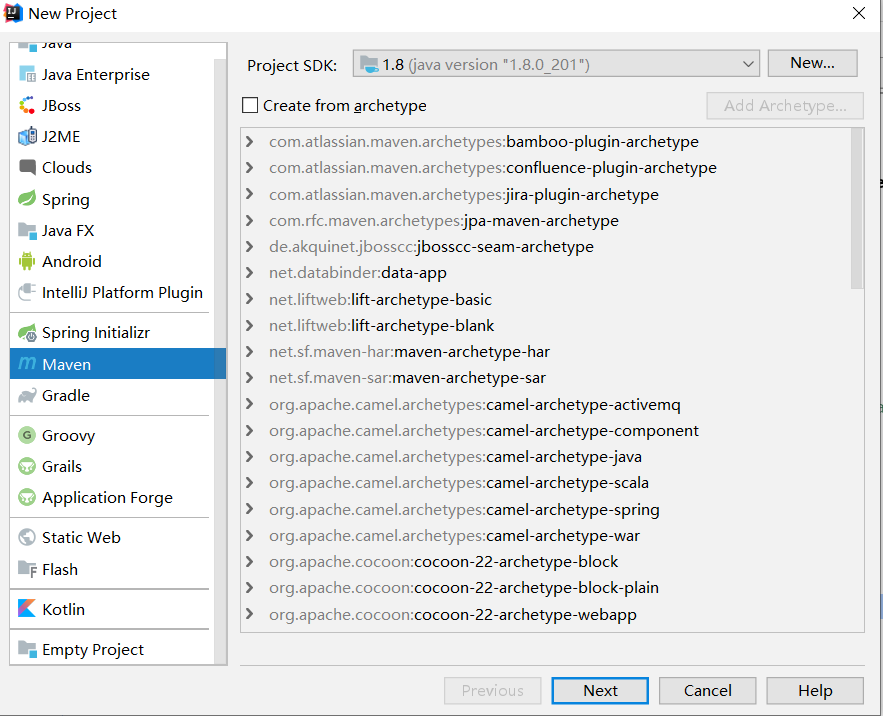
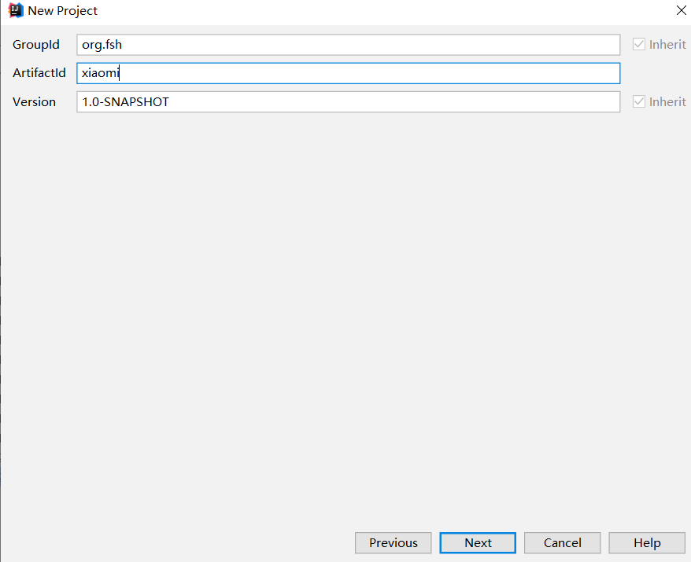
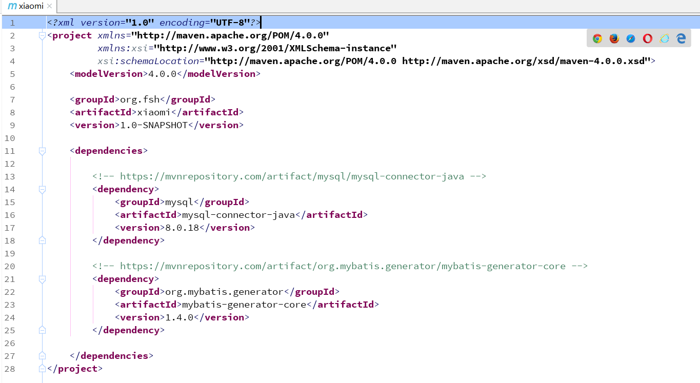
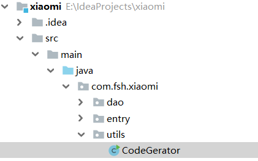
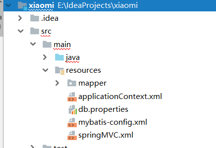
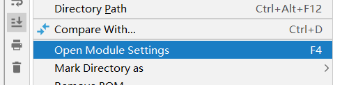
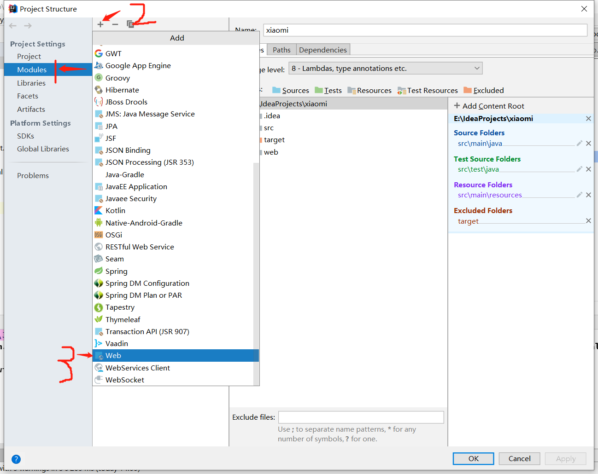
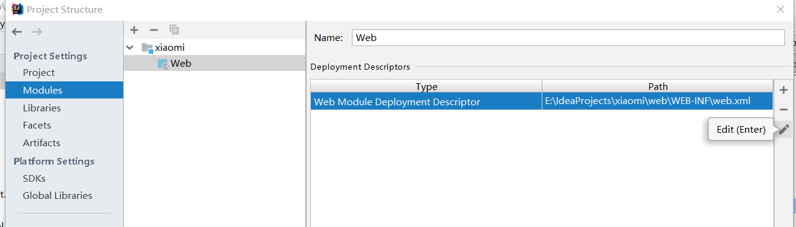
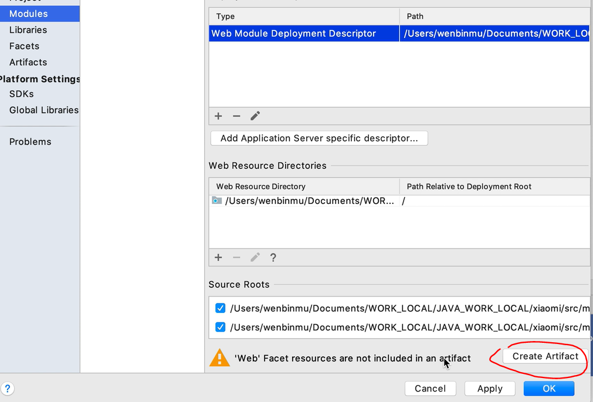

:lemon: My first SSM project :heart::purple_heart::blue_heart:
===

## 1. 用到的软件及版本
|软件|版本|
|---|---|
|`数据库`|`mysql 8.0.18`|
|`jdk`|`1.8.0_201`|
|`spring`|`(待定)`|
|`spring mvc`|`(待定)`|
|`mybatis`|`3.2.4`|
|_数据库连接驱动_|:arrow_down:|
|`mysql-connector-java`|`8.0.18`|
|_数据库连接池_|:arrow_down:|
|`dbcp/c3p0/druid`|`c3p0`|


## 2. `Mybatis`逆向工程

`逆向工程` 是通过数据库中已经存在的数据表, 反向生成java中的实体类

### (1) 创建商城项目
_代码生成器(逆向工程)作为商城项目的一个工具组件而存在_

`maven`项目, 不使用模板创建



引入工程依赖
* `mysql-connector-java-8.0.18.jar`
* `mybatis-generator-core.1.4.0.jar` (代码生成器的核心依赖)

到*http://mvnrepository.com* 搜索依赖


### (2) 配置生成规则

___逆向工程的`生成规则`, 就是描述数据库的表, 然后在`java`中生成对应的实体类, 同时生成映射配置文件___<br>
___`生成规则` 就是一个配置文件___

在项目的主目录中创建一个配置文件: `generator.xml`
```xml
<?xml version="1.0" encoding="UTF-8"?>
<!DOCTYPE generatorConfiguration
        PUBLIC "-//mybatis.org//DTD MyBatis Generator Configuration 1.0//EN"
        "http://mybatis.org/dtd/mybatis-generator-config_1_0.dtd">

<generatorConfiguration>

    <context id="DB2Tables" targetRuntime="MyBatis3">
        <!-- 配置数据源 -->
        <!-- 5.7版本之后的mysql要指定时间格式-->
        <jdbcConnection driverClass="com.mysql.jdbc.Driver"
                        connectionURL="jdbc:mysql://localhost:3306/xiaomi?serverTimezone=PRC"
                        userId="root"
                        password="123123">
        </jdbcConnection>

        <!-- 解析规则的配置(默认) -->
        <javaTypeResolver >
            <property name="forceBigDecimals" value="false" />
        </javaTypeResolver>

        <!-- 实体类 -->
        <!--下面的targetProject=".\src\..",配置实体类的存放路径,这是windows系统的配置,如果是Mac os 或者 linux 则改为'./src/..'-->
        <javaModelGenerator targetPackage="com.fsh.xiaomi.entry"
                            targetProject=".\src\main\java">
            <property name="enableSubPackages" value="true" />
            <property name="trimStrings" value="true" />
        </javaModelGenerator>

        <!--mapper文件-->
        <sqlMapGenerator targetPackage="mapper"
                         targetProject=".\src\main\resources">
            <property name="enableSubPackages" value="true" />
        </sqlMapGenerator>

        <!--DAO-->
        <javaClientGenerator type="XMLMAPPER"
                             targetPackage="com.fsh.xiaomi.dao"
                             targetProject=".\src\main\java">
            <property name="enableSubPackages" value="true" />
        </javaClientGenerator>

        <!--映射关系-->
        <!-- domainObjectName : 预对象名称,即在java中生成的pojo对象-->
        <table tableName="consumer" domainObjectName="Consumer"></table>
        <table tableName="goods" domainObjectName="Goods"></table>
        <table tableName="goods_images" domainObjectName="GoodsImages"></table>
        <table tableName="goods_type" domainObjectName="GoodsType"></table>
        <table tableName="goods_service" domainObjectName="GoodsService"></table>
        <table tableName="goods_package" domainObjectName="GoodsPackage"></table>
        <table tableName="goods_configure" domainObjectName="GoodsConfigure"></table>
        <table tableName="goods_cart" domainObjectName="GoodsCart"></table>
        <table tableName="goods_order" domainObjectName="GoodsOrder"></table>
        <table tableName="goods_order_item" domainObjectName="GoodsOrderItem"></table>
        <table tableName="goods_shipping_address" domainObjectName="GoodsShippingAddress"></table>

    </context>
</generatorConfiguration>
```


### (3) 实现逆向工程

通过配置文件指定的生成规则, 自动构建实体类和数据访问类,详情参考[官方文档](http://mybatis.org/generator/running/runningWithJava.html)


```java
package com.fsh.xiaomi.utils;

import org.mybatis.generator.api.MyBatisGenerator;
import org.mybatis.generator.config.Configuration;
import org.mybatis.generator.config.xml.ConfigurationParser;
import org.mybatis.generator.internal.DefaultShellCallback;

import java.io.File;
import java.util.ArrayList;
import java.util.List;

/**
 * 逆向工程  代码生成器
 *
 */
public class CodeGerator {
    public static void main(String[] args) throws Exception{
        List<String> warnings = new ArrayList<String>();
        boolean overwrite = true;
        File configFile = new File("generator.xml");
        ConfigurationParser cp = new ConfigurationParser(warnings);
        Configuration config = cp.parseConfiguration(configFile);
        DefaultShellCallback callback = new DefaultShellCallback(overwrite);
        MyBatisGenerator myBatisGenerator = new MyBatisGenerator(config, callback, warnings);
        myBatisGenerator.generate(null);
    }
}
```

## 3. SSSM项目整合
### (1)配置文件整合
`spring`配置文件: `src/main/resources/applicationContext.xml`  
`springMVC`配置文件: `src/main/resources/springMVC.xml`  
`mybatis`配置文件: `src/main/resources/mybatis-config.xml`  

_配置spring需要数据源,所以准备一个数据源的配置文件_  
`数据源`配置文件: `src/main/resources/db.properties`  

<br>
项目启动时, 框架初始化, 需要在 `web.xml` 中添加启动配置  
___在项目中创建对应的配置文件之后,给项目添加`web`支持:___  <br>

__(1)右键项目,然后点击`Open Module Settings`__  <br>
  
<br>
__(2)添加web配置__  <br>
  
<br>
__(3)点击`edit`按钮可以编辑版本(好像只有首次可以编辑版本)__  <br>
  
<br>
__(4)点击`Create Artifact`按钮__  <br>
  
<br>
__(5)点击`ok`完成创建__  <br>
<br>

### (2)依赖添加
_spring部分_  :arrow_down:
* `spring-core`
* `spring-context`
* `spring-beans`
* `spring-expression`
* `spring-insuiession`
* `spring-jdbc`
* `spring-orm`
* `spring-web`
* `spring-webmvc`

_mybatis部分_  :arrow_down:  

* `mybatis`
* `mybatis-spring`

_数据库连接部分_  :arrow_down:  

* `c3p0`
* `mysql-connector-java`