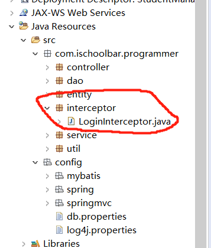

1.创建登录拦截器的包与类
==



* preHandle, 请求前执行
* postHandle， 请求中执行
* afterCompletion， 请求后执行


```java
package com.ischoolbar.programmer.interceptor;

import java.util.HashMap;
import java.util.Map;

import javax.servlet.http.HttpServletRequest;
import javax.servlet.http.HttpServletResponse;

import org.springframework.web.servlet.HandlerInterceptor;
import org.springframework.web.servlet.ModelAndView;

import com.ischoolbar.programmer.entity.User;

import net.sf.json.JSONObject;

/**
 * 登录过滤拦截器
 * @author Crspin
 *
 */
public class LoginInterceptor implements HandlerInterceptor {


	public void afterCompletion(HttpServletRequest arg0, HttpServletResponse arg1, Object arg2, Exception arg3)
			throws Exception {
		// TODO Auto-generated method stub

	}

	public void postHandle(HttpServletRequest arg0, HttpServletResponse arg1, Object arg2, ModelAndView arg3)
			throws Exception {
		// TODO Auto-generated method stub

	}

	public boolean preHandle(HttpServletRequest request, HttpServletResponse response, Object arg2) throws Exception {
		// TODO Auto-generated method stub
		String url = request.getRequestURI();
		// System.out.println("进入拦截器，url = " + url);
		User user = (User)request.getSession().getAttribute("user");
		if(user == null) {
			// 未登录或登陆状态失效
			System.out.println("未登录或登陆失效 url = " + url);
			if("XMLHttpRequest".equals(request.getHeader("X-Requested-With"))) {
				/**
				 *  在填写用户信息后，点击“提交”按钮的时候，由于是ajax请求
				 * 所以无法触发下面的重定向
				 * 所以对ajax请求单独进行判断
				 */
				// ajax请求
				Map<String, String> ret = new HashMap<String, String>();
				ret.put("type","error");
				ret.put("msg", "登陆状态失效，请重新登录！");
				response.getWriter().write(JSONObject.fromObject(ret).toString());
				return false;
			}
			// 重定向到登陆界面，request.getContextPath()获取项目的根目录
			response.sendRedirect(request.getContextPath() + "/system/login");
			return false;
		}
		return true;
	}

}

```


2.在Spring-MVC的配置文件中加入登录拦截器
==

```xml
<!-- 后台访问拦截器 -->
	 <mvc:interceptors>
		<mvc:interceptor>
			<mvc:mapping path="/**"/>
			<mvc:exclude-mapping path="/system/login"/>
			<mvc:exclude-mapping path="/system/get_cpacha"/>
			<mvc:exclude-mapping path="/h-ui/**"/>
			<mvc:exclude-mapping path="/easyui/**"/>
			<bean class="com.ischoolbar.programmer.interceptor.LoginInterceptor"></bean>
		</mvc:interceptor>
	</mvc:interceptors>
```

