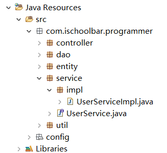

学生信息管理系统
===

## 系统环境

|  软件   | 版本  |
| :-----: | :---: |
| Spring  | 4.3.9 |
| Mybatis | 3.4.4 |
|  c3p0   | 0.9.1 |
|  MySQL  |  5.8  |
| Tomcat  |  9.0  |

## 项目结构

* controller 用于存放控制类，
* dao 与数据库打交道的层，需要与mapper配置文件结合使用
* entity 实体类所在的包，数据库中的每张表都对应一个实体类
* service 业务类，声明实体有哪些方法
* service.impl 业务实现类，实体操作的具体实现（通过Dao层接口的实体进行实现数据库操作）
* util 其它类

