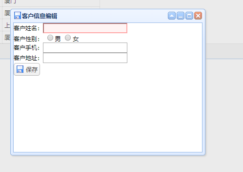

主要的功能包括

* 客户数据分页展示
* 客户数据添加
* 客户数据修改
* 客户数据删除

这几个功能大体都是按照以下顺序进行开发（从左到右）：

| 页面组件开发                                                 | 控制类开发                                                   | 业务接口开发                     | 业务实现类                                                   | Mapper接口                             | Mapper的xml文件                         |
| ------------------------------------------------------------ | ------------------------------------------------------------ | -------------------------------- | ------------------------------------------------------------ | -------------------------------------- | --------------------------------------- |
| 在jsp文件进行前端页面的开发，指定后端要进行响应的路径，有必要的话要把参数传到后台 | 在控制类中注入一个业务接口（service）对象，控制类中的方法要用`@RequestMapping()`注解映射路径，并通过`@ResponseBody`注解把返回对象变为json格式，然后利用接口对象，实现接口中的方法 | 接口类中提供了控制类中需要的方法 | 在业务实现类中注入一个Mapper接口对象，利用该对象，在业务实现类的方法中调用Mapper接口中的方法 | Mapper接口中提供了业务实现类需要的方法 | 给Mapper接口中的方法装配上相应的sql语句 |


1.客户数据分页显示
---

```java
	<table id="list"></table> 

<!-- 工具条 -->
  	<div id="tb">
  		<a id="addBtn" href="#" class="easyui-linkbutton" data-options="iconCls:'icon-add',plain:true">添加</a>
  		<a id="editBtn" href="#" class="easyui-linkbutton" data-options="iconCls:'icon-edit',plain:true">修改</a>
  		<a id="deleteBtn" href="#" class="easyui-linkbutton" data-options="iconCls:'icon-remove',plain:true">删除</a>
  	</div>
  	
  	<!-- 编辑窗口 -->
  	<div id="win" class="easyui-window" title="客户信息编辑" style="width:400px;height:300px"
  		data-options="iconCls:'icon-save',modal:true, closed:true">
  		<form id="editForm" method="post">
  			<%-- 提供id隐藏域，用来区分新增和修改--%>
  			<input type="hidden" name="id"/>
  			客户姓名：<input type="text" name="name" class="easyui-validatebox" data-options="required:true"/><br/>
		   	客户性别：
		   	<input type="radio" name="gender" value="男"/>男
		   	<input type="radio" name="gender" value="女"/>女
		   	<br/>
		   	客户手机：<input type="text" name="telephone"/><br/>
		   	客户地址：<input type="text" name="address"/><br/>
		   	<a id="saveBtn" href="#" class="easyui-linkbutton" data-options="iconCls:'icon-save'">保存</a>
  		</form>
  	</div>
```





### 1) 前端页面

```java
$(function(){
  			$("#list").datagrid({
  				//url:后台数据查询的地址
  				url:"customer/listByPage.action",
  				//columns：填充的列数据
  				//field:后台对象的属性
  				//tille:列标题
  				columns:[[
  					{
  						field:"id",
  						title:"客户编号",
  						width:100,
  						checkbox:true
  					},
  					{
  						field:"name",
  						title:"客户姓名",
  						width:200
  					},
  					{
  						field:"gender",
  						title:"客户性别",
  						width:200
  					},
  					{
  						field:"telephone",
  						title:"客户手机",
  						width:200
  					},
  					{
  						field:"address",
  						title:"客户住址",
  						width:200
  					}
  				]],
  				// 添加pagination属性，进行分页
  				pagination:true,
  				// 工具条
  				toolbar:"#tb"
  				
  			});
```

### 2） 控制类

```java
// 注入service对象
	@Resource
	private CustomerService customerService;


/*
	 * 查询所有数据
	 * 给页面返回json格式的数据
	 * easyui的datagrid组件，需要展示数据提供json格式：[{id:1,name:xxx},{id:2,name:xxx}]
	 */
	@RequestMapping("/list")
	@ResponseBody  // 用于转换对象为json
	public List<Customer> list(){
		// 查询数据
		List<Customer> list = customerService.findAll();
		
		return list;
	}
```

### 3) 业务接口

```java
public List<Customer> findAll();
```

### 4)  业务实现类

```java
// 注入一个Mapper接口对象
	@Resource
	private CustomerMapper customerMapper;
	
	public List<Customer> findAll() {
		return customerMapper.findAl();
	}
```

### 5) Mapper接口

```java
public List<Customer> findAl();
```

### 6) Mapper的xml配置

```xml
<!-- 查询所有数据 -->
	<select id="findAl" resultType="cn.sm1234.domain.Customer">
		SELECT id,
			NAME,
			gender,
			telephone,
			address
			FROM
		ssm.t_customer
	</select>
```

