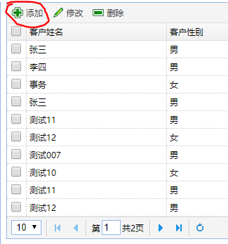
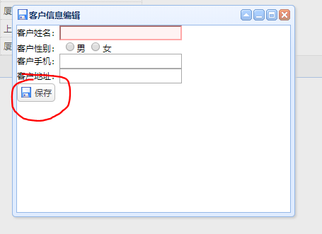

## 客户数据添加

### 1） 页面

```java
// 点击添加按钮
$("#addBtn").click(function(){
    // 清空各个输入栏
    $("#editForm").form("clear");
    // 打开编辑窗口
    $("#win").window("open");
});
```



```java
// 保存数据
$("#saveBtn").click(function(){
    $("#editForm").form("submit",{
        // url，数据提交的地址
        url:"customer/save.action",
        // 提交前的回调函数，返回true:提交表单，返回false：不提交表单
        onSubmit:function(){
            // 判断表单的验证是否通过
            return $("#editForm").form("validate");
        },
        // success: 服务器执行完毕之后的回调函数
        success:function(data){ // data: 服务器返回的数据，类型是String
            data = eval("("+ data + ")");
            if(data.success){
                // 关闭窗口
                $("#win").window("close");
                //刷新datagrid
                $("#list").datagrid("reload");
                $.messager.alert("提示","保存成功","info")
            }else{
                $.messager.alert("提示","保存失败:"+ data.msg,"error")
            }
        }
    });
});
```



### 2)  控制类

__控制类中注入了CustomerService对象__

```java
/*
	 * 保存数据
	 */
	@RequestMapping("/save")
	@ResponseBody  // 用于转换对象为json
	public Map<String,Object> save(Customer customer){
		try {
			customerService.save(customer);
			result.put("success", true);
		} catch (Exception e) {
			// TODO Auto-generated catch block
			e.printStackTrace();
			result.put("success",false);
			result.put("msg",e.getMessage());
		}
		return result;
	}
```


### 3) 业务接口-CustomerService

```java
public void save(Customer customer);
```


### 4) 业务实现类-CustomerServiceImpl

```java
public void save(Customer customer) {
    // TODO Auto-generated method stub
    // 如果用户id不为空，则是修改
    // 为空则是新增
    if(customer.getId()!=null) {
        customerMapper.update(customer);
    }else {
        customerMapper.save(customer);
    }
}
```

### 5) Mapper接口

```java
public void save(Customer customer);
```

### 6) Mapper的xml文件

__id="save"__这里的`save`是要与Mapper接口中的函数名保持一致

```java
	<insert id="save" parameterType="cn.sm1234.domain.Customer">
		INSERT INTO ssm.t_customer
			(
			NAME,
			gender,
			telephone,
			address
			)
			VALUES
			(
			#{name},
			#{gender},
			#{telephone},
			#{address}
			)
	</insert>
```


