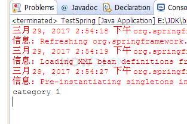

***IOC，反转控制，简单说以前由new方法来产生一个新的对象，现在交由Spring创建对象***

***DI,依赖注入,就是拿到对象属性的时候，属性已经有了相关的值，直接使用就可以***

第一步，创建项目
第二步，导入jar包
[第三步，创建一个实体类Category](#3)
[第四步，核心配置文件applicationContext.xml](#4)
[第五步，测试类](#5)

<h3 id="3">第三步，创建一个实体类Category</h3><br>

```java
package com.how2java.pojo;
 
public class Category {
 
    public int getId() {
        return id;
    }
    public void setId(int id) {
        this.id = id;
    }
    public String getName() {
        return name;
    }
    public void setName(String name) {
        this.name = name;
    }
    private int id;
    private String name;
}
```

<h3 id="4">第四步，核心配置文件applicationContext.xml</h3><br>


***在src目录下新建applicationContext.xml文件 applicationContext.xml是Spring的核心配置文件***

```xml
<?xml version="1.0" encoding="UTF-8"?>
<beans xmlns="http://www.springframework.org/schema/beans"
    xmlns:xsi="http://www.w3.org/2001/XMLSchema-instance"
    xmlns:aop="http://www.springframework.org/schema/aop"
    xmlns:tx="http://www.springframework.org/schema/tx"
    xmlns:context="http://www.springframework.org/schema/context"
    xsi:schemaLocation="
   http://www.springframework.org/schema/beans
   http://www.springframework.org/schema/beans/spring-beans-3.0.xsd
   http://www.springframework.org/schema/aop
   http://www.springframework.org/schema/aop/spring-aop-3.0.xsd
   http://www.springframework.org/schema/tx
   http://www.springframework.org/schema/tx/spring-tx-3.0.xsd
   http://www.springframework.org/schema/context     
   http://www.springframework.org/schema/context/spring-context-3.0.xsd">
  
    <bean name="c" class="com.how2java.pojo.Category">
        <property name="name" value="category 1" />
    </bean>
  
</beans>
```

***通过关键字 c 即可获取Category对象，该对象获取的时候，就带有值为"category 1"的name属性***

<h3 id="5">第五步，测试类</h3><br>

```java
import org.springframework.context.ApplicationContext;
import org.springframework.context.support.ClassPathXmlApplicationContext;
 
import com.how2java.pojo.Category;
 
public class TestSpring {
 
    public static void main(String[] args) {
    	// 读取配置文件
        ApplicationContext context = new ClassPathXmlApplicationContext(
                new String[] { "applicationContext.xml" });
 		
 		// 利用配置中的name="c"获取cateogory对象，对象由spring生成
        Category c = (Category) context.getBean("c");
         
        System.out.println(c.getName());
    }
}
```

