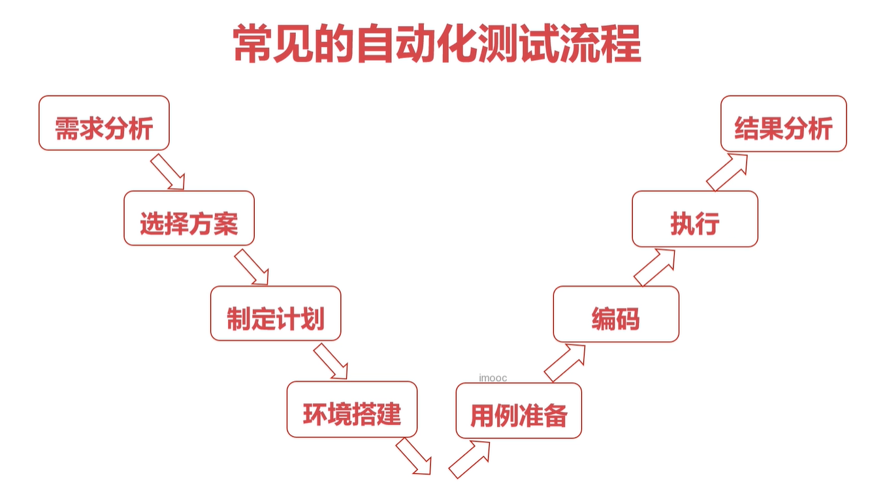
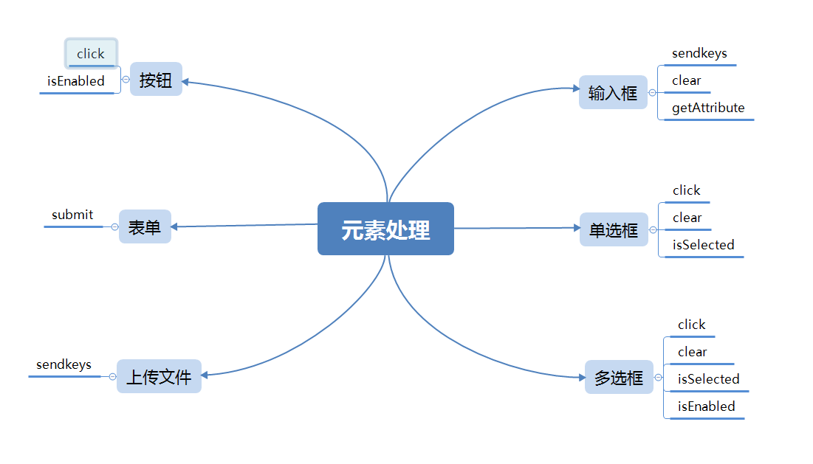
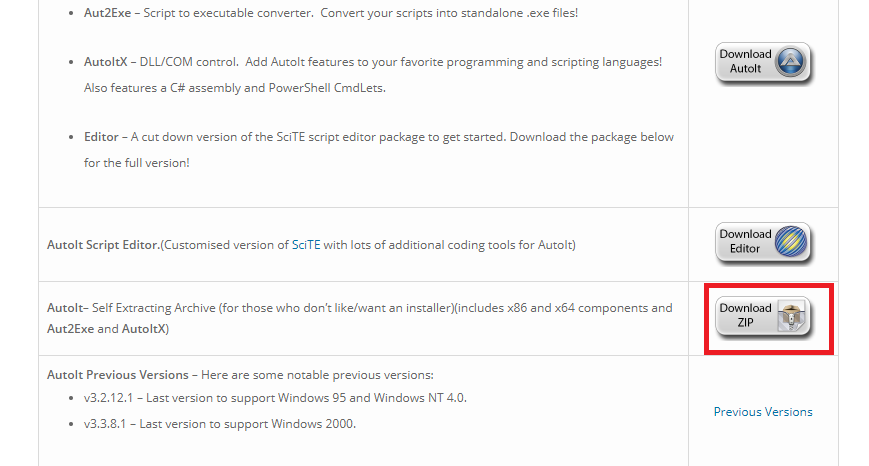
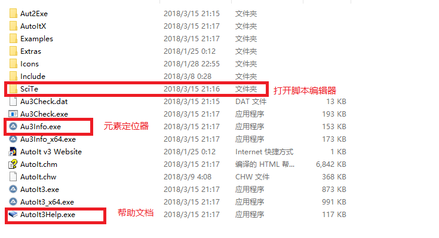
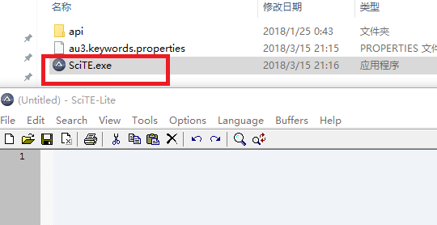
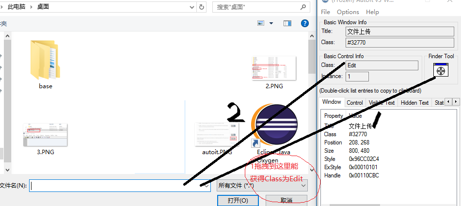
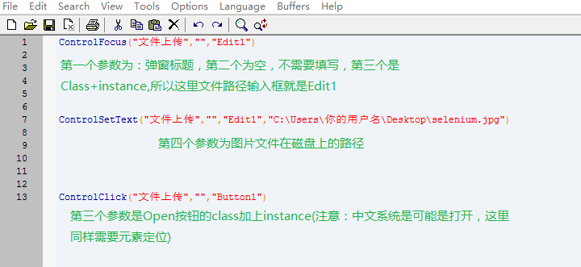
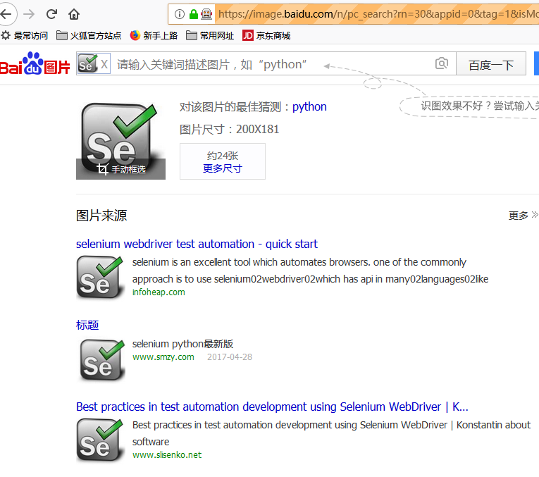
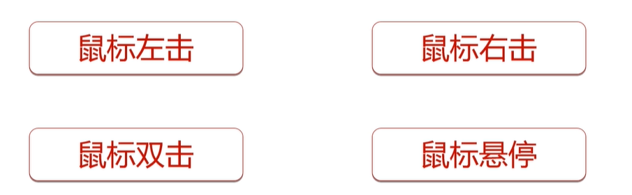

[toc]


# 常见的自动化测试流程



# selenium基础知识

| 常用定位元素的方式                      |                                                              |
| --------------------------------------- | ------------------------------------------------------------ |
| 通过id定位                              | findElement(By.id("xxxx"))                                   |
| 通过name定位                            | findElement(By.name("xxxx"))                                 |
| 通过class定位                           | findElement(By.className("xxxx"))                            |
| 通过标签名定位                          | findElement(By.tagName("xxxx")                               |
| 通过多元素定位                          | List<WebElement> elements =  findElements(By.className("xxxx"));<br />elements.get(2); |
| 通过标签内文字定位                      | findElement(By.linkText("xxxx"));                            |
| 通过部分文字定位                        | findElement(By.partialLinkText("xx"));                       |
| <font color="blue">通过xpath定位</font> | findElement(By.xpath("//*[@id="shop-cart"]/a"));             |
| <font color="blue">通过css定位</font>   | findElement(By.cssSelector("#header-avator"));               |

## 常见元素处理



# 文件上传

## input标签

对于input标签的文件上传可以直接定位input标签,然后使用sendkey的方式将文件地址发送给input标签即可实现文件上传

`driver.findElement(By.id("upload")).sendKeys("C:\\Users\\Crspin\\Pictures\\bh3rd\\2020-10-29-00-03-34_0.png");`


## autoit

使用autoit编写脚本生成exe文件,然后在java代码中调用相应的exe文件,即可执行

`Runtime.getRuntime().exec("exe文件地址")`

以上是第一种方的实现，第二种方式是利用AutoIt这个工具。这是一个能支持桌面GUI自动化的工具，它支持脚本语言编写。在Selenium脚本中如果需要AutoIt来协助这个文件上传功能，大概步骤是这样的：

\1. Selenium点击web产品上的文件上传按钮，弹窗上传框。

2.执行AutoIt实现准备好的脚本文件，这个脚本文件写了关于上传什么文件的一个.exe文件。

在一切测试工作之前，我们先下载和安装AutoIt。

1）打开AutoIt的官网下载地址

https://www.autoitscript.com/site/autoit/downloads/

2）点击下载zip，当然也可以下载Editor。

 

解压得到的效果如图：



 

3）点击SciTe文件夹，我们打开脚本编辑器。双击SciTE.exe



4）打开百度图片上传窗口，同时打开AutoIt 脚本编辑器和元素定位器。拖动元素定位器上那个靶点形状按钮到文件上传弹窗，能够捕获到一些元素信息。

 

5）在AutoIt脚本编辑器里输入如下脚本，绿色部分为解释的，不需要写。



6）编译成一个.exe文件

先保存到本地，例如默认路径保存，名称为UploadFile.au3,然后在AutoIt脚本编辑器中点击Tools菜单，选择compile,会在同路径下生成一个UploadFile.exe的文件，待会在Selenium脚本要使用。


 

7）Selenium脚本执行UploadFile.exe文件，观察文件是否上传。

```java
package first;

import java.util.concurrent.TimeUnit;

import org.openqa.selenium.By;

import org.openqa.selenium.WebDriver;

import org.openqa.selenium.firefox.FirefoxDriver;

public class AutoIt {

public  static  void main(String[] args) **throws** Exception{

    WebDriver driver=**new** FirefoxDriver();

    driver.manage().window().maximize();

    driver.manage().timeouts().implicitlyWait(4, TimeUnit.***SECONDS\***);


    driver.get("http://www.baidu.com");

    //点击照相机这个工具

    driver.findElement(By.*xpath*("//*/span[@class='soutu-btn']")).click();

    //点击本地上传图片 

    driver.findElement(By.*xpath*("//*/div[@class='upload-wrap']")).click();

    // 执行桌面的AutoIt封装的脚本

    Runtime.*getRuntime*().exec("C:\\Users\\你的用户名\\Desktop\\UploadFile.exe");

}

}
```


我用的是火狐62，最终的效果如图所示：




## <font color='red'>利用Robot类处理文件上传</font>

其大致流程可以为：

1、 利用selenium点击web上本地文件的上传按钮；

2、 在弹出的弹框中，文件路径输入框默认的是光标的聚焦，将文件在磁盘上的路径通过拷贝和黏贴的方法写上去。

3、 通过按下回车，默认触发弹框的确定按钮，完成文件上传的功能。

这里以百度首页的利用图片搜索为例：

 打开百度首页，搜索按钮左侧有一个照相机的图标，点击可以选择图片搜索，我们通过本地上传图片的过程来模拟文件自动化上传操作。准备条件，在百度图片搜索一个图片，保存到桌面，例如找到一个关于selenium的图片，然后保存在桌面，名称为selenium.jpg。

相关实现代码如下：

```java
package first;

import java.awt.Robot;

import java.awt.Toolkit;

import java.awt.datatransfer.StringSelection;

import java.awt.event.KeyEvent;

import java.util.concurrent.TimeUnit;

import org.openqa.selenium.By;

import org.openqa.selenium.WebDriver;

import org.openqa.selenium.firefox.FirefoxDriver;

public class shangchuang {

        public static void main(String[] args)throws Exception {

                WebDriver driver=new FirefoxDriver();

                driver.manage().window().maximize();

                driver.manage().timeouts().implicitlyWait(4, TimeUnit.SECONDS);


                driver.get("https://www.baidu.com");

                //指定图片路径

                StringSelection selection=new StringSelection("C:\\Users\\你的用户名\\Desktop\\selenium.jpg");

                //把图片路径复制到剪切板

                Toolkit.getDefaultToolkit().getSystemClipboard().setContents(selection, null);

                System.out.println("selection"+selection);

                //点击照相机这个工具

                driver.findElement(By.xpath("//*/span[@class='soutu-btn']")).click();

                //点击本地上传图片

                driver.findElement(By.xpath("//*/div[@class='upload-wrap']")).click();


                //新建一个Robot类的对象

                Robot robot=new Robot();

                Thread.sleep(1000);

                //按下Ctrl+V

                robot.keyPress(KeyEvent.VK_CONTROL);

                robot.keyPress(KeyEvent.VK_V);

                //释放Ctrl+V

                robot.keyRelease(KeyEvent.VK_CONTROL);

                robot.keyRelease(KeyEvent.VK_V);

                Thread.sleep(2000);

                //点击回车

                robot.keyPress(KeyEvent.VK_ENTER);

                robot.keyRelease(KeyEvent.VK_ENTER);

        }

}
```


# Select下拉框选择

## 方式一: 点击下拉框, 再点击下拉框中的元素,模拟用户的操作


## 方式二:selenium之 下拉选择框Select

```java
// 实例化Select对象
Select sel = new Select(driver.findElement(By.xpath("//select[@id='province-select']")));
// 查找对应的元素
sel.selectByValue("5");
```


* 选择对应的元素
* 不选择对应的元素
* 获取选择项的值

**选择对应的元素**

> Index : 通过下标选择
>
> Text : 通过标签内的文本值选择
>
> Value : 通过value属性的值进行选择

**不选择对应的元素**

>deselectAll : 取消所有的选择
>
>deselectByValue : 通过option的value值来取消对应的option
>
>deselectByVisibleText : 通过对应的text文本值取消对应的option

**获取选择项的值**

> getAllSelectOptions(): 返回所有选中的optionElement对象
> 
>
> getFirstSlectedOption() : 返回第一个选中的optionElement对象


# Selenium鼠标操作

## 常用鼠标操作



### 鼠标左击

**Actions action = new Actions(driver);**

**action.click(目标元素).preform();**


### 鼠标右击

**Actions action = new Actions(driver);**

**action.contextClick(目标元素).preform();**


### 鼠标双击

**Actions action = new Actions(driver);**

**action.doubleClick(目标元素).preform();**


### 鼠标悬停

**Actions action = new Actions(driver);**

**action.moveToElement(目标元素).perform();**

# 窗体跳转

## iframe

* switchTo()


## 弹窗

* 

## 浏览器窗口


* switchTo()

* getWindowHandles()

