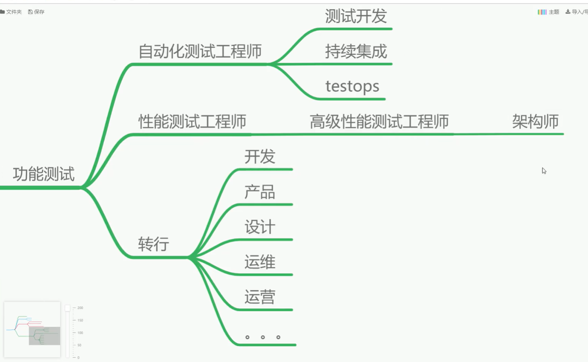
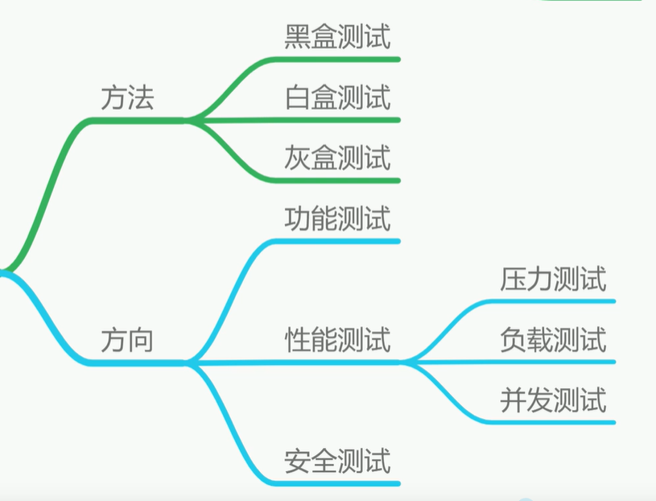
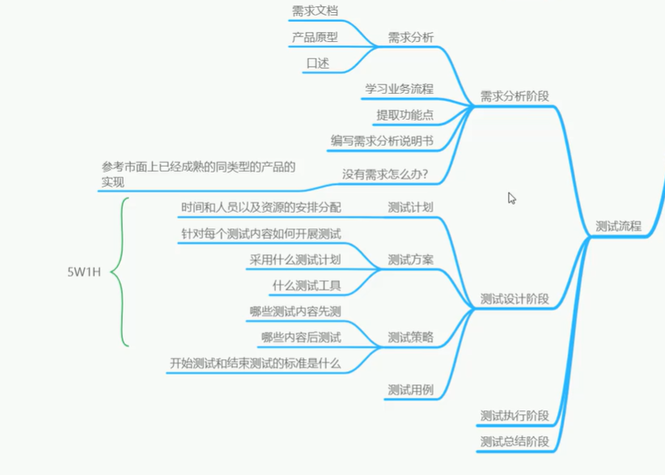
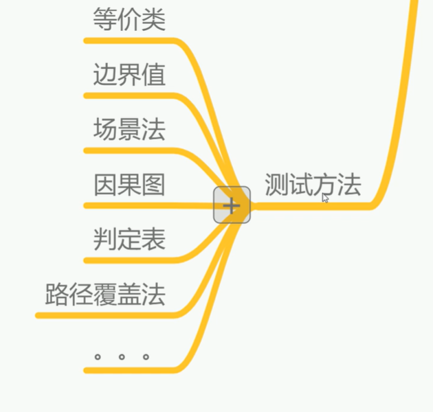

## 软件测试职业发展路线

## 软件测试的分类

**方法**: 黑盒测试/ 白盒测试/ 灰盒测试

**方向**: 功能测试/ 性能测试/ 安全测试

**阶段**: 单元测试/ 集成测试/ 系统测试/ 验收测试

## 测试流程

## 测试方法

## 测试用例

| 用例编号 | 用例名称 | 测试背景 | 前置条件 | 重要级 | 优先级 | 测试数据 | 测试步骤 | 预期结果 | 实际结果 | 编写人 | 执行人 | 备注 |
| -------- | :------: | :------- | -------- | ------ | ------ | -------- | -------- | -------- | -------- | ------ | ------ | ---- |
|          |          |          |          |        |        |          |          |          |          |        |        |      |
|          |          |          |          |        |        |          |          |          |          |        |        |      |
|          |          |          |          |        |        |          |          |          |          |        |        |      |

