[toc]

## 1.软件测试基础知识

`掌握测试各阶段所需的知识及技能,了解软件生存周期各阶段测试人员的职责`

### 软件的生命周期

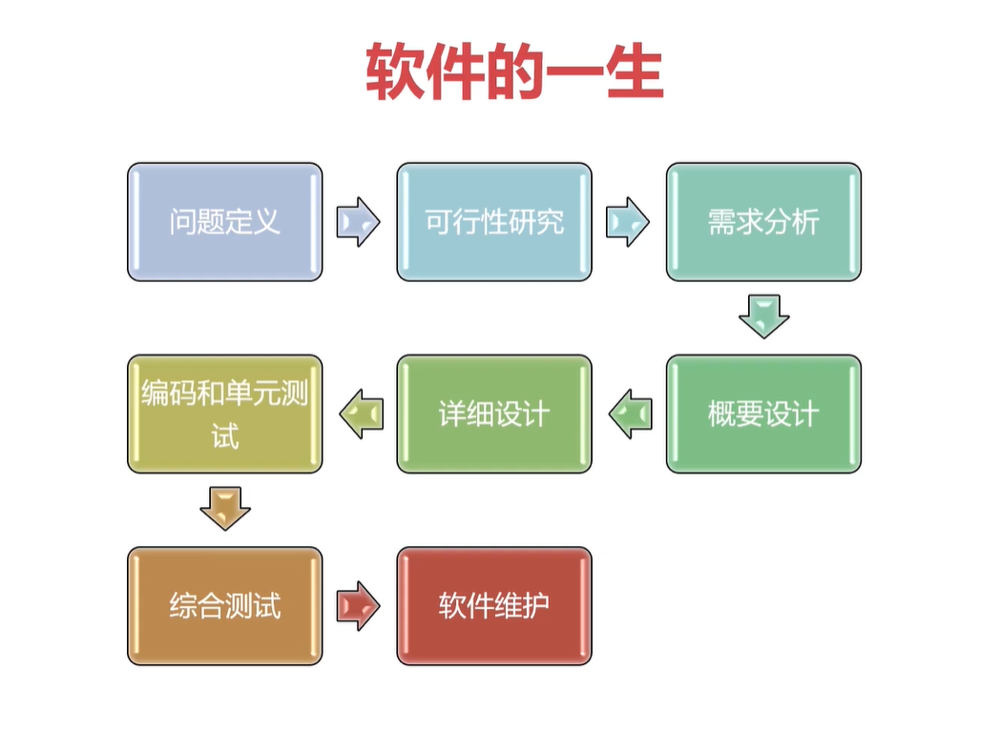

* 问题定义: 要解决的问题是什么
* 可行性研究: 确定该问题是否存在一个可以解决的方案
* 需求分析: 深入具体的了解用户的需求
* 概要设计: 设计出实现目标系统的几种可能方案,设计程序的体系结构
* 详细设计: 详细设计每个模块,确定实现模块功能所需的算法和数据结构
* 编码和单元测试: 
* 综合测试: 
* 软件维护: 

### 软件测试的方法和分类

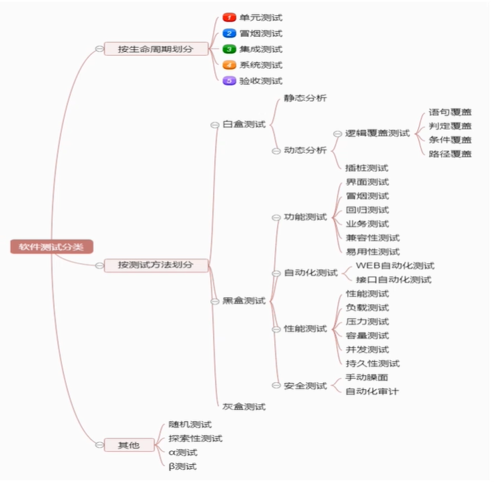

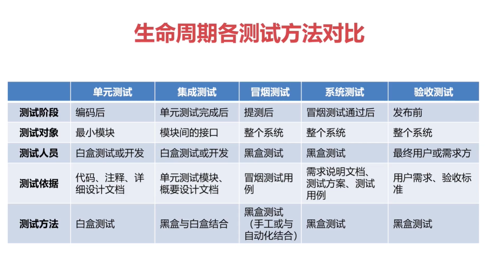

### 软件测试常见模型

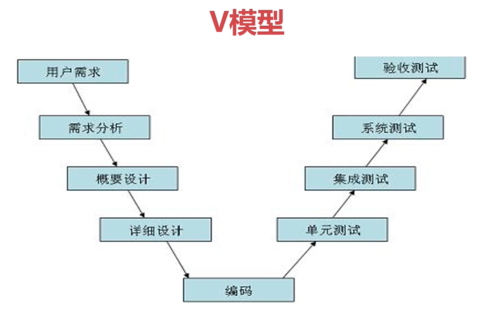

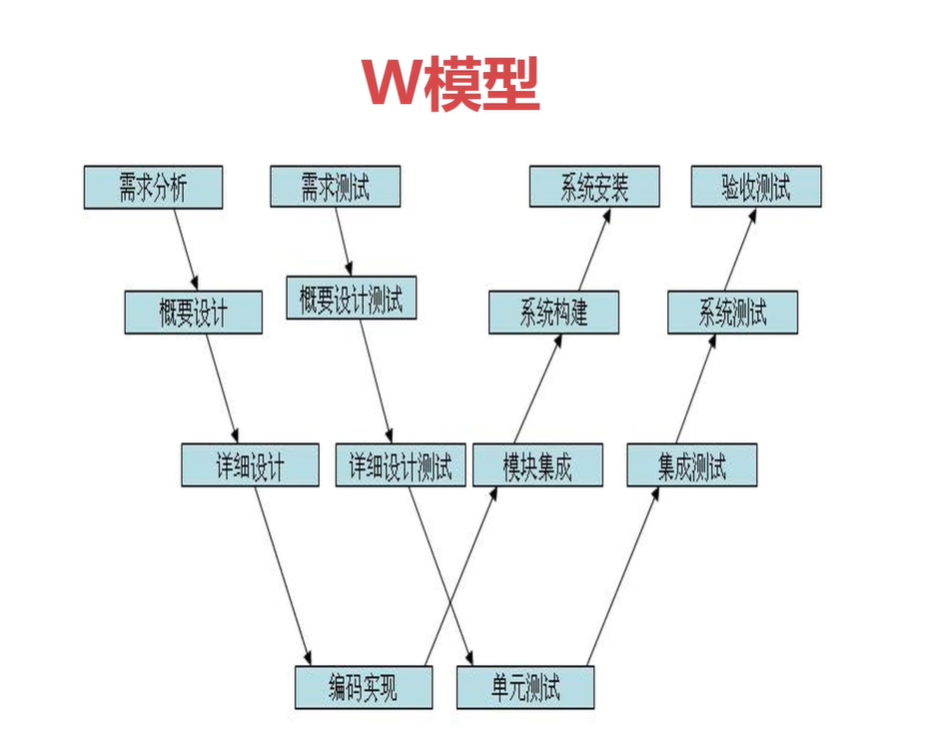

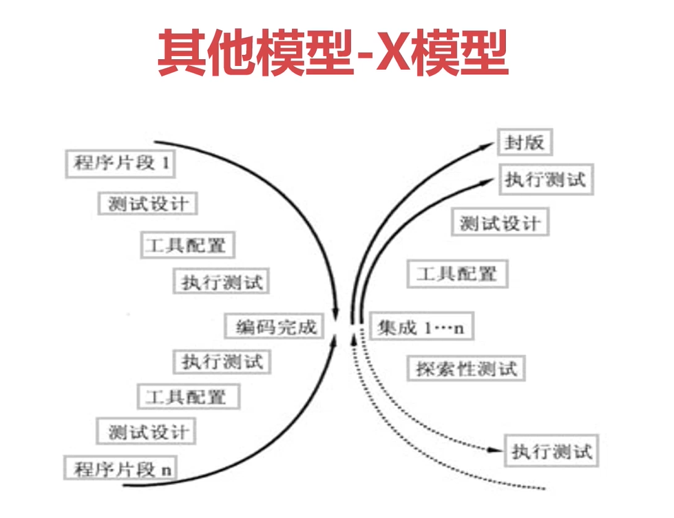

## 2.软件测试流程

`学习破解软件测试的流程及测试策略,计划,方案的编写与评审过程`

## 3.软件测试设计

`从设计入手,学习常用的测试需求分析,黑盒测试用例设计以及常用测试技术应用`

测试用例应具有可重复性, 可验证性和需求可追踪性

### 测试用例关键点

> 前提条件, 如项目或局部测试环境的需求, 及其交付计划
>
> 测试步骤
>
> 测试数据
>
> 预期结果

### 测试用例案例

| 序号 | 模块名称 | 用例名称(测试意图) | 用例级别 | 预置条件 | 测试步骤 | 预期结果 | 测试结果 | 缺陷编号 | 备注 |
| ---- | -------- | ------------------ | -------- | -------- | -------- | -------- | -------- | -------- | ---- |
|      |          |                    |          |          |          |          |          |          |      |
|      |          |                    |          |          |          |          |          |          |      |
|      |          |                    |          |          |          |          |          |          |      |

### 测试用例常用设计方法

#### 等价类划分法

* 如果输入条件规定了取值的范围或者值得个数,则可确定一个有效等价类和两个无效等价类

  

* 如果一个输入条件说明了一个"必须成立"的情况,则可划分一个有效等价类和一个无效等价类(要么ture, 要么false)

  

* 如果输入条件规定了输入数据的一组可能的值,而且程序是用不同的方式处理每一种值, 则可为每一种值划分一个有效等价类, 并划分一个无效等价类

##### 等价类实战: 计算两个数相加,  -99<= 有效值 <=99 

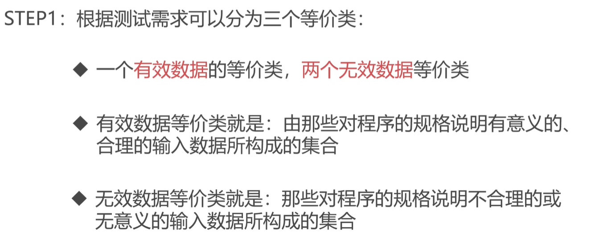

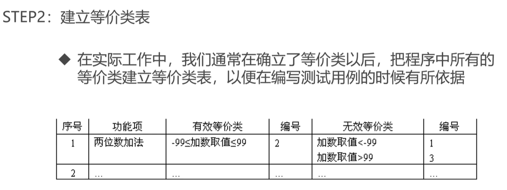

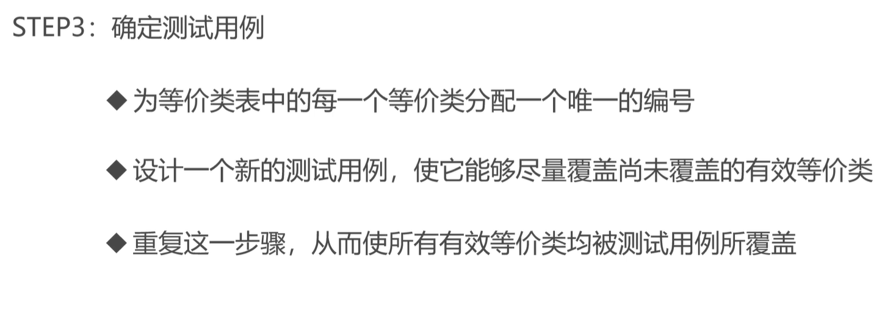

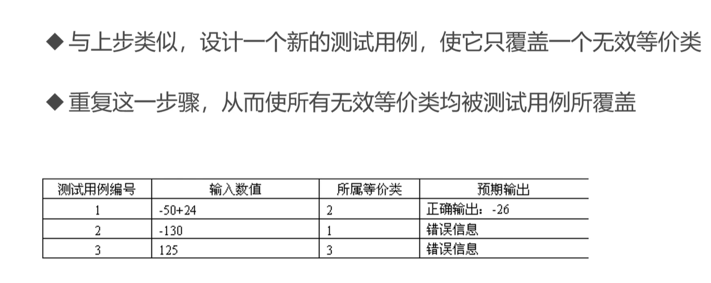

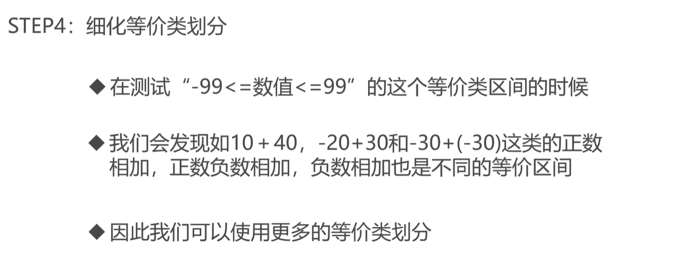

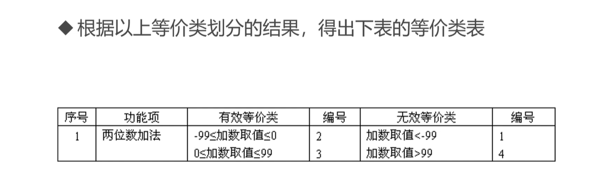

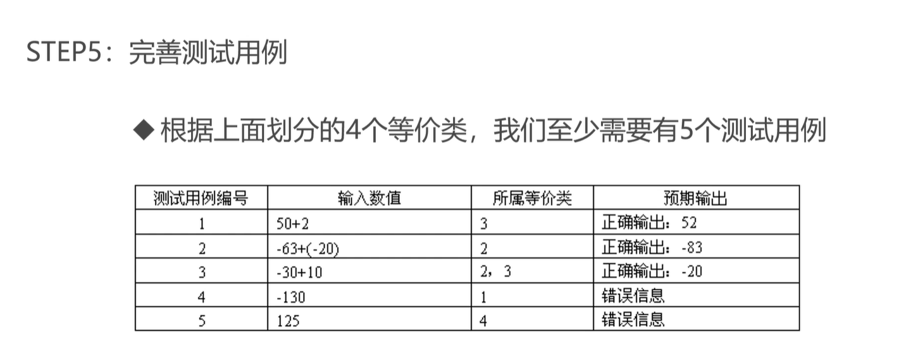

#### 练习: 三角形的边

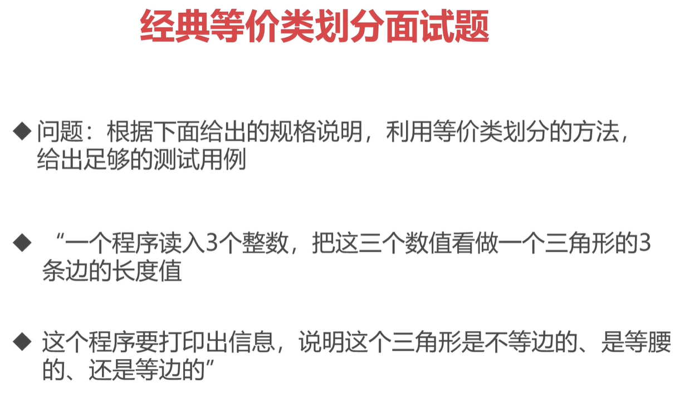

| 序号     | 功能项         | 有效等价类                          | 编号     |
| -------- | -------------- | ----------------------------------- | -------- |
| 1        | 构成普通三角形 | a,b,c均为正数,a+b>c, a-b<c          | 1        |
| 2        | 构成等腰三角形 | a,b,c均为正数,a+b>c, a-b<c, 且a=b   | 2        |
| 3        | 构成等边三角形 | a,b,c均为正数,a+b>c, a-b<c, 且a=b=c | 3        |
|          |                |                                     |          |
| **序号** | **功能项**     | **无效等价类**                      | **编号** |
| 4        | 不构成三角形   | a+b 小于等于 c                      | 4        |
|          |                | a-b 大于等于c                       | 5        |
|          |                | a,b,c中存在负数                     | 6        |
|          |                |                                     |          |

#### 边界值法

* 如果输入条件规定了取值范围, 应以该范围的边界内以及刚刚超范围的边界外的值作为测试用例

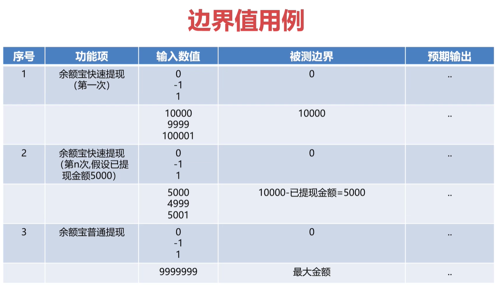

#### 因果图设& 判定表法

* 等价类划分法和边界值分析方法都是着重考虑输入条件, 而不考虑输入条件的各种组合, 输入条件之间的相互制约关系 

  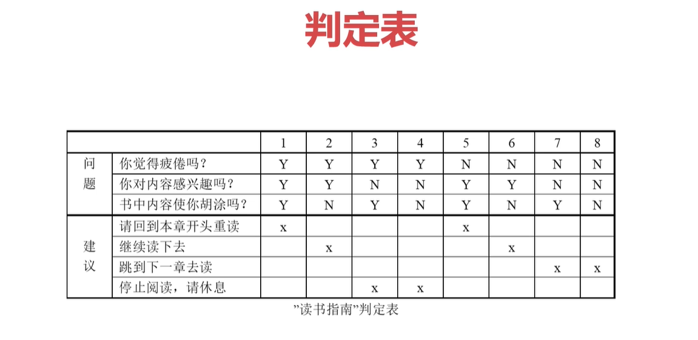

  

1. 分析软件规格说明中哪些是原因(即输入条件或输入条件的等价类), 哪些是结果(即输出条件), 并给每个原因和结果赋予一个标识符
2. 找出原因与结果之间, 原因与原因之间对应的关系, 根据这些关系画出因果图(可跳过)
3. 为某些特定的情况,在因果图上使用一些记号表明约束或限制条件(可跳过)
4. 把因果图转换为判定表
5. 根据判定表中的每一列测试设计用例

#### 正交实验法

## 4.测试执行管理

`学习测试用例的执行,测试的缺陷管理,跟踪及测试总结,熟悉各种测试文档的编写`

## 5.功能测试项目实践

`通过实战项目,将所学的测试理论知识应用于真实的测试项目中`

## 6.测试技术深化

`从自动化,性能,安全以及白盒测试方面的测试手段和方法,对软件测试技术进行进一步深化`

## 7.手机APP测试

`学习app测试与web测试的不同点,常见的测试点,弱网,兼容性测试模式,并初步介绍app自动化测试的实现方法`

## 8.测试总结

`对测试过程进行一个总结`

## 9,面试

